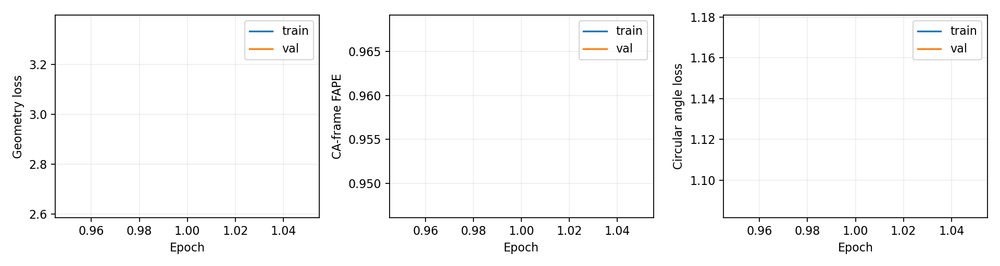
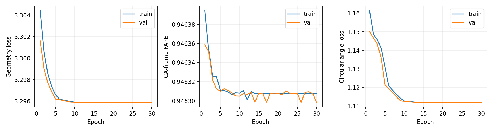
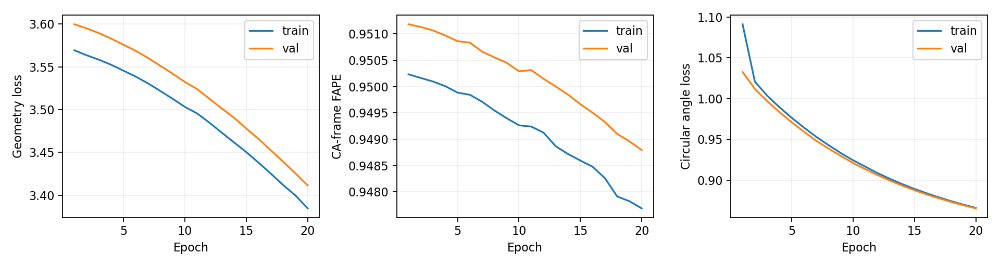

# SE(3) residue refiner validation

Production models: manifest-selected 40-character epoch-40 encoder and decoder, both frozen. The unrefined baseline uses the decoder’s three-dimensional bottleneck, the same coordinate source supplied to the refiner.
These are structure-level refiner holdouts; independence from production pretraining is not claimed.

Hardware: physical GPU 1 (NVIDIA RTX PRO 4000 Blackwell), 23.42 GiB.

Software: torch 2.8.0, torch-geometric 2.6.1, pytorch-lightning 2.6.0, gotennet-pytorch 0.3.1, e3nn 0.5.9, numpy 1.26.4, PyYAML 6.0.2, tmtools 0.3.0 (temporary target /tmp/foldtree2-se3-deps).

| Input | SHA-256 |
|---|---|
| dataset | `2c970702701a5bf789dd46974ff689f02c0805dcf146746db8d1eba07a2b3673` |
| encoder | `75d176f4dd11fa1e676c536be953b78a767c40c405b425a49182192fbb6a7fc6` |
| decoder | `b9642afd20db829a5ce2dd1c908c86df0c351319347fccd2ad1d335b3aa9089d` |

Selected structure IDs, split membership and preprocessing settings are recorded in each run’s `provenance.json`.

## Smoke

Structures: 1 training, 1 evaluation. Skipped during selection: 4; complete chains only.

Completed epochs: 1. Logged failures: 0. Completed: True.

Selected checkpoint: epoch 1. Frozen parameters and buffers unchanged: True. Nonfinite events: 0.

Training geometry loss: 3.359828 → 3.359828 (0.0% reduction).

| Epoch | Train geometry | Validation FAPE | Grad norm | Seconds | Peak GPU GiB |
|---:|---:|---:|---:|---:|---:|
| 1 | 3.35983 | 0.94720 | 0.142 | 0.7 | 0.74 |

First epoch: 0.7 s; final recorded epoch: 0.7 s. Peak host memory: 2.41 GiB.

| Metric | Frozen decoder | Refined | Mean paired delta |
|---|---:|---:|---:|
| fape | 0.944061 | 0.947198 | +0.003138 |
| ca_rmsd | 12.893137 | 13.364745 | +0.471608 |
| tm_score | 0.090242 | 0.068826 | -0.021416 |
| lddt | 0.018808 | 0.015771 | -0.003037 |
| ca_bond_mae | 3.614756 | 3.842503 | +0.227747 |
| ca_bond_deviation_3_8 | 3.568047 | 3.795794 | +0.227747 |
| angle_mae_radians | unavailable | 1.7896230220794678 | unavailable |
| ca_bend_mae_radians | 1.418327 | 1.064002 | -0.354325 |
| ca_torsion_mae_radians | 1.540236 | 1.625671 | +0.085435 |

Coordinates and masks are paired per structure; full pairs are in `paired_metrics.json`.

FAPE improves for 0/1 evaluated structures.

Coordinate scale diagnosis (mean across evaluation structures):

| Quantity | Baseline | Refined | Target |
|---|---:|---:|---:|
| radius_rms (Å) | 1.5149 | 0.0206 | 13.3716 |
| bond_mean (Å) | 0.2320 | 0.0042 | 3.8467 |

Distance-contact density below 8 Å: 1.0000. A high density means these bottleneck coordinates produce nearly complete distance graphs.

The refined trace remains strongly compressed relative to the targets. The backend returns a normalized degree-1 coordinate projection, and this refiner has no residual addition of seed coordinates. Together with the uncalibrated bottleneck scale, these are likely causes of the observed collapse; this is a diagnosis, not a demonstrated causal ablation. Calibrate coordinate units and investigate an identity-preserving residual update before increasing capacity or duration.

Observed batch size 1 profile from the first epoch, including warmup; adjacency storage scales as N² and attention intermediates cost more:

| Residue length bucket | Samples | Mean forward/backward seconds | Cumulative peak GPU GiB |
|---|---:|---:|---:|
| 129–256 | 1 | 0.1730 | 0.74 |

Profiles cover batch size 1 only; larger batches and atom-level graphs have not been validated.

## Overfit

Structures: 32 training, 32 evaluation. Skipped during selection: 25; complete chains only.

The overfit evaluation uses the same 32 training structures.

Completed epochs: 30. Logged failures: 0. Completed: True.

Selected checkpoint: epoch 30. Frozen parameters and buffers unchanged: True. Nonfinite events: 0.

Training geometry loss: 3.304416 → 3.295885 (0.3% reduction).

| Epoch | Train geometry | Validation FAPE | Grad norm | Seconds | Peak GPU GiB |
|---:|---:|---:|---:|---:|---:|
| 1 | 3.30442 | 0.94636 | 0.0651 | 12.0 | 1.51 |
| 2 | 3.30063 | 0.94635 | 0.0485 | 4.7 | 1.51 |
| 3 | 3.29851 | 0.94632 | 0.0427 | 4.7 | 1.51 |
| 4 | 3.29736 | 0.94631 | 0.0405 | 4.7 | 1.51 |
| 5 | 3.29660 | 0.94631 | 0.0449 | 4.7 | 1.51 |
| 6 | 3.29618 | 0.94631 | 0.0476 | 4.8 | 1.51 |
| 7 | 3.29612 | 0.94631 | 0.0475 | 4.7 | 1.51 |
| 8 | 3.29604 | 0.94631 | 0.0478 | 4.6 | 1.51 |
| 9 | 3.29597 | 0.94631 | 0.0482 | 4.7 | 1.51 |
| 10 | 3.29592 | 0.94630 | 0.0483 | 4.7 | 1.51 |
| 11 | 3.29591 | 0.94631 | 0.0486 | 4.8 | 1.51 |
| 12 | 3.29590 | 0.94631 | 0.0487 | 5.2 | 1.51 |
| 13 | 3.29590 | 0.94631 | 0.0487 | 5.1 | 1.51 |
| 14 | 3.29589 | 0.94630 | 0.0489 | 5.2 | 1.51 |
| 15 | 3.29589 | 0.94631 | 0.0482 | 4.9 | 1.51 |
| 16 | 3.29589 | 0.94631 | 0.0481 | 5.3 | 1.51 |
| 17 | 3.29589 | 0.94630 | 0.0483 | 5.2 | 1.51 |
| 18 | 3.29589 | 0.94631 | 0.0484 | 5.2 | 1.51 |
| 19 | 3.29589 | 0.94631 | 0.0482 | 5.0 | 1.51 |
| 20 | 3.29589 | 0.94631 | 0.0482 | 5.1 | 1.51 |
| 21 | 3.29589 | 0.94631 | 0.0482 | 5.2 | 1.51 |
| 22 | 3.29589 | 0.94631 | 0.0487 | 5.2 | 1.51 |
| 23 | 3.29589 | 0.94631 | 0.0483 | 5.2 | 1.51 |
| 24 | 3.29589 | 0.94631 | 0.0484 | 5.2 | 1.51 |
| 25 | 3.29589 | 0.94631 | 0.0482 | 5.1 | 1.51 |
| 26 | 3.29589 | 0.94630 | 0.0481 | 4.8 | 1.51 |
| 27 | 3.29588 | 0.94631 | 0.0481 | 4.8 | 1.51 |
| 28 | 3.29588 | 0.94631 | 0.0487 | 4.9 | 1.51 |
| 29 | 3.29588 | 0.94631 | 0.0482 | 5.1 | 1.51 |
| 30 | 3.29588 | 0.94630 | 0.0481 | 5.2 | 1.51 |

First epoch: 12.0 s; final recorded epoch: 5.2 s. Peak host memory: 2.43 GiB.

| Metric | Frozen decoder | Refined | Mean paired delta |
|---|---:|---:|---:|
| fape | 0.944481 | 0.946298 | +0.001817 |
| ca_rmsd | 18.456422 | 19.303854 | +0.847431 |
| tm_score | 0.083547 | 0.063599 | -0.019947 |
| lddt | 0.025176 | 0.022473 | -0.002703 |
| ca_bond_mae | 3.636395 | 3.820279 | +0.183884 |
| ca_bond_deviation_3_8 | 3.595421 | 3.779305 | +0.183884 |
| angle_mae_radians | unavailable | 1.723920065909624 | unavailable |
| ca_bend_mae_radians | 1.434585 | 1.352436 | -0.082150 |
| ca_torsion_mae_radians | 1.520147 | 1.521497 | +0.001350 |

Coordinates and masks are paired per structure; full pairs are in `paired_metrics.json`.

FAPE improves for 0/32 evaluated structures.

Overfit gate (≥20% training geometry reduction and lower FAPE than decoder): **False**.

Coordinate scale diagnosis (mean across evaluation structures):

| Quantity | Baseline | Refined | Target |
|---|---:|---:|---:|
| radius_rms (Å) | 1.5508 | 0.0936 | 19.3562 |
| bond_mean (Å) | 0.2046 | 0.0207 | 3.8410 |

Distance-contact density below 8 Å: 0.9998. A high density means these bottleneck coordinates produce nearly complete distance graphs.

The refined trace remains strongly compressed relative to the targets. The backend returns a normalized degree-1 coordinate projection, and this refiner has no residual addition of seed coordinates. Together with the uncalibrated bottleneck scale, these are likely causes of the observed collapse; this is a diagnosis, not a demonstrated causal ablation. Calibrate coordinate units and investigate an identity-preserving residual update before increasing capacity or duration.

Observed batch size 1 profile from the first epoch, including warmup; adjacency storage scales as N² and attention intermediates cost more:

| Residue length bucket | Samples | Mean forward/backward seconds | Cumulative peak GPU GiB |
|---|---:|---:|---:|
| 1–64 | 5 | 0.3600 | 1.51 |
| 65–128 | 12 | 0.3152 | 1.51 |
| 129–256 | 15 | 0.3199 | 1.51 |

Profiles cover batch size 1 only; larger batches and atom-level graphs have not been validated.

## Pilot

Structures: 512 training, 128 evaluation. Skipped during selection: 209; complete chains only.

Completed epochs: 20. Logged failures: 0. Completed: True.

Selected checkpoint: epoch 20. Frozen parameters and buffers unchanged: True. Nonfinite events: 0.

Training geometry loss: 3.569278 → 3.384625 (5.2% reduction).

| Epoch | Train geometry | Validation FAPE | Grad norm | Seconds | Peak GPU GiB |
|---:|---:|---:|---:|---:|---:|
| 1 | 3.56928 | 0.95118 | 0.0456 | 125.9 | 3.31 |
| 2 | 3.56344 | 0.95113 | 0.0384 | 67.7 | 3.31 |
| 3 | 3.55831 | 0.95106 | 0.0378 | 66.5 | 3.31 |
| 4 | 3.55231 | 0.95097 | 0.0385 | 65.3 | 3.31 |
| 5 | 3.54542 | 0.95086 | 0.0388 | 65.6 | 3.31 |
| 6 | 3.53853 | 0.95083 | 0.0399 | 64.5 | 3.31 |
| 7 | 3.53058 | 0.95066 | 0.0402 | 65.5 | 3.31 |
| 8 | 3.52173 | 0.95055 | 0.0396 | 68.4 | 3.31 |
| 9 | 3.51267 | 0.95045 | 0.0401 | 64.9 | 3.31 |
| 10 | 3.50320 | 0.95029 | 0.0413 | 62.7 | 3.31 |
| 11 | 3.49551 | 0.95031 | 0.08 | 69.4 | 3.31 |
| 12 | 3.48469 | 0.95015 | 0.0458 | 67.6 | 3.31 |
| 13 | 3.47313 | 0.95000 | 0.0474 | 65.8 | 3.31 |
| 14 | 3.46171 | 0.94985 | 0.0509 | 66.3 | 3.31 |
| 15 | 3.45035 | 0.94967 | 0.0507 | 66.7 | 3.31 |
| 16 | 3.43805 | 0.94950 | 0.0535 | 61.3 | 3.31 |
| 17 | 3.42526 | 0.94933 | 0.0546 | 65.5 | 3.31 |
| 18 | 3.41191 | 0.94910 | 0.0548 | 64.5 | 3.31 |
| 19 | 3.39979 | 0.94896 | 0.0717 | 62.1 | 3.31 |
| 20 | 3.38463 | 0.94879 | 0.0577 | 67.8 | 3.31 |

First epoch: 125.9 s; final recorded epoch: 67.8 s. Peak host memory: 2.53 GiB.

| Metric | Frozen decoder | Refined | Mean paired delta |
|---|---:|---:|---:|
| fape | 0.949674 | 0.948793 | -0.000880 |
| ca_rmsd | 20.933254 | 21.103346 | +0.170092 |
| tm_score | 0.077176 | 0.080011 | +0.002835 |
| lddt | 0.025882 | 0.032640 | +0.006759 |
| ca_bond_mae | 3.644223 | 3.401866 | -0.242357 |
| ca_bond_deviation_3_8 | 3.602439 | 3.360082 | -0.242357 |
| angle_mae_radians | unavailable | 1.3726732451468706 | unavailable |
| ca_bend_mae_radians | 1.443426 | 1.316939 | -0.126487 |
| ca_torsion_mae_radians | 1.555018 | 1.556289 | +0.001271 |

Coordinates and masks are paired per structure; full pairs are in `paired_metrics.json`.

FAPE improves for 124/128 evaluated structures.

Held-out FAPE improves: **True**. Material regressions: **none**.

The operational no-regression thresholds are 5% for error metrics and 0.01 absolute for TM-score/lDDT.

Proceed to larger training (overfit and held-out gates): **False**. Preserve and diagnose failed metrics before increasing model size or duration.

Coordinate scale diagnosis (mean across evaluation structures):

| Quantity | Baseline | Refined | Target |
|---|---:|---:|---:|
| radius_rms (Å) | 1.5320 | 1.5815 | 21.8196 |
| bond_mean (Å) | 0.1976 | 0.4399 | 3.8418 |

Distance-contact density below 8 Å: 0.9998. A high density means these bottleneck coordinates produce nearly complete distance graphs.

The refined trace remains strongly compressed relative to the targets. The backend returns a normalized degree-1 coordinate projection, and this refiner has no residual addition of seed coordinates. Together with the uncalibrated bottleneck scale, these are likely causes of the observed collapse; this is a diagnosis, not a demonstrated causal ablation. Calibrate coordinate units and investigate an identity-preserving residual update before increasing capacity or duration.

Observed batch size 1 profile from the first epoch, including warmup; adjacency storage scales as N² and attention intermediates cost more:

| Residue length bucket | Samples | Mean forward/backward seconds | Cumulative peak GPU GiB |
|---|---:|---:|---:|
| 1–64 | 34 | 0.2272 | 3.31 |
| 65–128 | 152 | 0.1872 | 3.31 |
| 129–256 | 206 | 0.2197 | 3.31 |
| 257–384 | 120 | 0.2715 | 3.31 |

Profiles cover batch size 1 only; larger batches and atom-level graphs have not been validated.

## Warmed dense and padding profile

Frozen caches and the final pilot checkpoint; evaluation mode with backward, without optimizer steps. Peak counters are reset per measurement after one warmup, and times average three repeats.

| Lengths | Valid nodes | Batch | Padding nodes | Padded adjacency bytes | Unpadded bytes | Seconds | Peak GPU GiB |
|---|---|---:|---:|---:|---:|---:|---:|
| [64] | [63] | 1 | 0 | 4096 | 4096 | 0.0975 | 0.16 |
| [126] | [126] | 1 | 0 | 15876 | 15876 | 0.0988 | 0.45 |
| [256] | [111] | 1 | 0 | 65536 | 65536 | 0.1019 | 0.36 |
| [384] | [337] | 1 | 0 | 147456 | 147456 | 0.1215 | 2.70 |
| [64, 384] | [63, 337] | 2 | 320 | 294912 | 151552 | 0.1871 | 2.79 |
| [256, 384] | [111, 337] | 2 | 128 | 294912 | 212992 | 0.1873 | 2.98 |
| [256, 384] | [111, 337] | 2 | 128 | 294912 | 212992 | 0.1826 | 2.98 |
| [64, 126] | [63, 126] | 2 | 62 | 31752 | 19972 | 0.1709 | 0.54 |

Validated training envelope: complete chains ≤384 residues, microbatch size 1, effective batch size 8. Batch-size-2 profile results measure allocation and output consistency only; larger training batches and atom-level graphs remain unvalidated. The local wrapper compacts valid nodes before GotenNet, so backend attention avoids padded rows even though packed adjacency still allocates B×Nmax² entries.

External stack sampling was unavailable because process tracing requires administrator permissions; in-process timings and CUDA memory counters were collected instead.

## Correctness and failed startup attempts

The final CPU/CUDA correctness suite passed all 59 tests, including the original 29 geometry/frame tests. Compatible resume restored epoch 30 and step 120 without extra training; an incompatible checkpoint was rejected before provenance replacement. Evidence is retained in `cuda-correctness-test.log`, `overfit-resume.log` and `resume-rejection-check.json`.

Correctness logs are retained in `runs/se3_validation/correctness-tests.log` and `tooling-tests.log`. The first smoke attempt failed cache parity because frozen CUDA graph reductions were nondeterministic. Deterministic CUDA algorithms resolved the mismatch. The first overfit selection contained a structure with zero confidence-masked targets and was rejected before training; target eligibility is now explicit. These attempts and tracebacks are retained in `smoke_attempt_01` / `overfit_attempt_01`. A first pilot was interrupted before completing an epoch when a stronger frame test exposed cancellation after restoring translation; `pilot_attempt_01` is preserved. Final frames use centered vectors before restoring origins. A subsequent audit found that endpoint frame masks omitted the third residue used by their normals. This affected two overfit structures and nine pilot structures. Those completed runs are preserved in `overfit_endpoint_mask_attempt` and `pilot_endpoint_mask_attempt`; the final runs repeat the same bounded configurations with corrected masks. Endpoint mask tests verify that masked coordinates cannot influence FAPE.

## Metric scope and limitations

FAPE uses geometry-defined CA frames, masks undefined orientations and frame stencils across masked residues, clamps at 10 Å and divides by 10. RMSD uses Kabsch alignment; TM-score uses TM-align. lDDT evaluates valid CA pairs within 15 Å. Bond geometry is CA–CA distance error; N–CA and C–N atom bond metrics are deferred with atom refinement. Angle error includes paired CA virtual bend/torsion errors and circular MAE in radians from decoder/refiner heads. A missing decoder angle head is reported as unavailable, not replaced by zero.

Raw logs, checkpoints, cache identity, selected IDs, configuration, software versions and per-structure pairs are retained under the run directories. Production checkpoints and alphabet benchmarks are unchanged.
